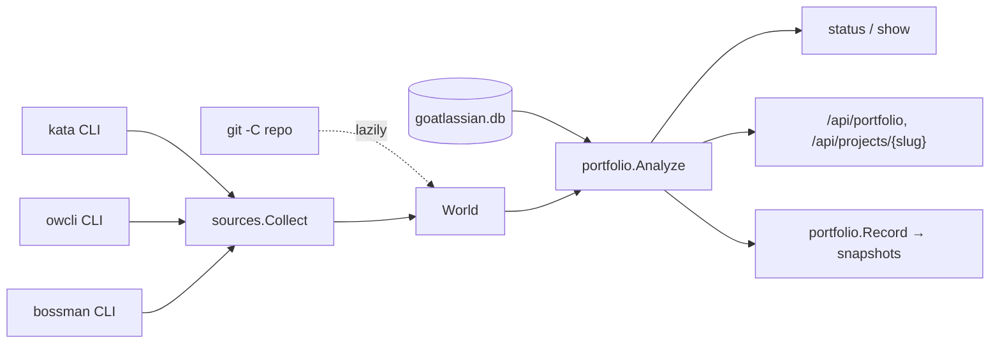

# Architecture Overview

goatlassian is a single Go binary (`cmd/goatlassian`) with a command line and a
local web UI. It groups artifacts owned by other tools into **projects** and
reports on them. It owns very little data itself: the grouping, lifecycle
state, a log, and metric snapshots. Everything else is read, on demand, from
the sibling tools through their command lines.

## Packages

| Package | Role |
| --- | --- |
| `cmd/goatlassian` | `main` calls `cli.Execute()` and exits with its code. |
| `internal/cli` | Cobra commands; resolves the data directory and config before every command. See [CLI Reference](../reference/cli.md). |
| `internal/config` | Data directory resolution and `config.toml`. See [Configuration and Services](../operations/configuration-and-services.md). |
| `internal/store` | SQLite: projects, components, events, snapshots. See [Projects, Components, and the Store](../concepts/projects-and-components.md). |
| `internal/sources` | Runs `kata`, `owcli`, `bossman`, and `git`, parses their JSON into a `World`. See [Tool Adapters and Discovery](tool-adapters.md). |
| `internal/discover` | Proposes projects from what the tools know; adopts directories; normalizes hand-attached components. |
| `internal/portfolio` | Joins store and `World` into per-project reports, metrics, and health flags. See [Portfolio Analysis](../concepts/portfolio-analysis.md). |
| `internal/services` | Checks and starts the sibling web UIs. |
| `internal/web` | `goatlassian serve`: JSON API plus an embedded single-page UI. See [Web UI and JSON API](web-ui.md). |
| `internal/testutil` | A fake `Runner` that answers tool commands from a table. |

## Data flow

1. A command (or a web request) calls `sources.Collect`, which runs the kata,
   owcli, and bossman collectors concurrently and returns a `World`: every kata
   project and issue, every owcli wiki and workspace, and every bossman session.
   Git status is read lazily per repository and cached in the `World`.
2. `portfolio.Analyze` loads projects and components from the store and, for
   each component, asks the `World` what its tool says about it. It sums
   metrics per project, derives last activity, and computes flags and health.
3. The CLI prints the result (`status`, `show`); the web server returns it as
   JSON; `portfolio.Record` stores it as snapshots for history.

Collection is bulk rather than per component: one `kata list --all`, one
`owcli wikis --json`, one `bossman ls -n 0` serve every project, so a full
portfolio refresh stays fast however many projects exist. The CLI collects
once per command with a 60-second timeout; the web server caches one `World`
for 20 seconds and re-collects on `?refresh=1`.

## Design rules

- **Integrate through the tools' CLIs, link to their UIs.** goatlassian never
  opens kata's, owcli's, or bossman's databases. It runs their commands with
  `--json` and builds deep links into their web UIs, so each tool stays the
  system of record for its domain.
- **Never write into a repository.** All state lives in goatlassian's data
  directory, so it can be used on projects where adding files is not allowed.
- **Degrade, do not fail.** A missing binary, a stopped daemon, or bad output
  from one tool becomes a `Problem` string on that tool; the rest of the
  report is still produced, and the affected components show the problem.
- **Open-ended kinds.** A component kind is free text. Kinds without an
  adapter are stored and displayed (URLs are linked), so new artifact types
  can be attached before anyone writes an adapter for them. See
  [Adding a Component Kind](../workflows/adding-a-component-kind.md).
- **Testable without the tools.** Everything that runs a process goes through
  the `sources.Runner` interface; tests substitute `testutil.Runner`.
